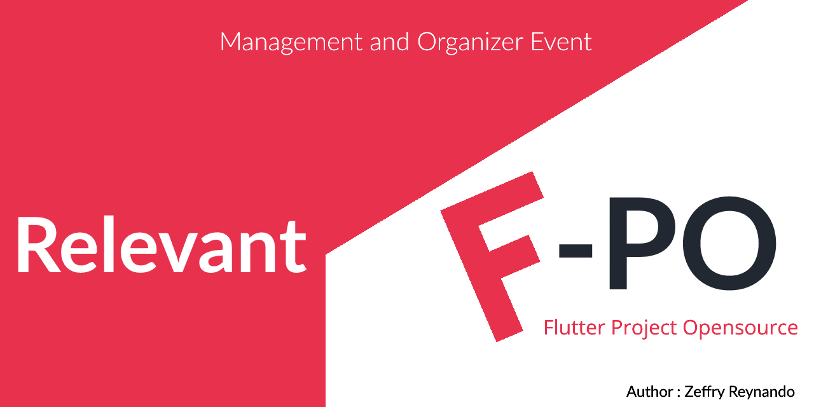
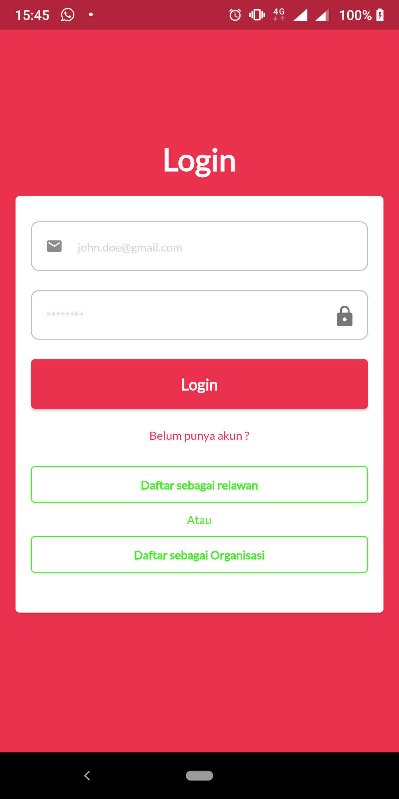
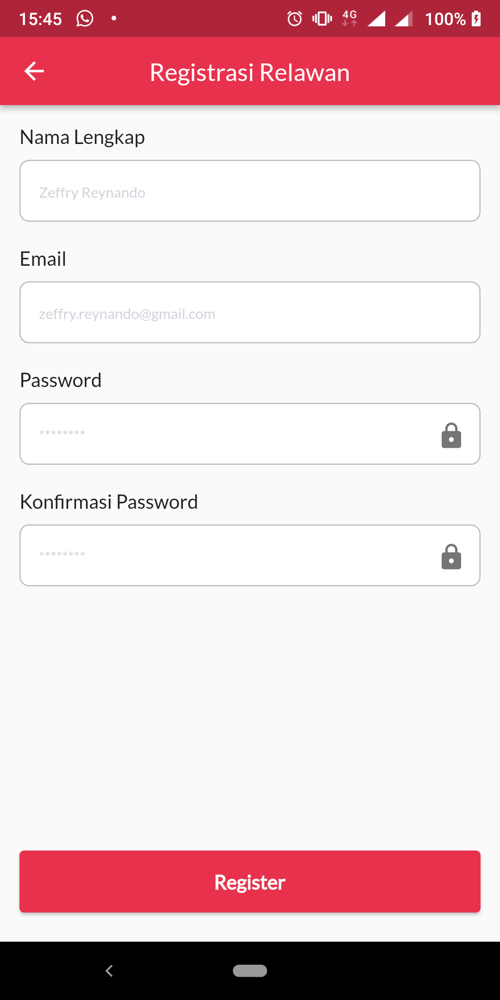
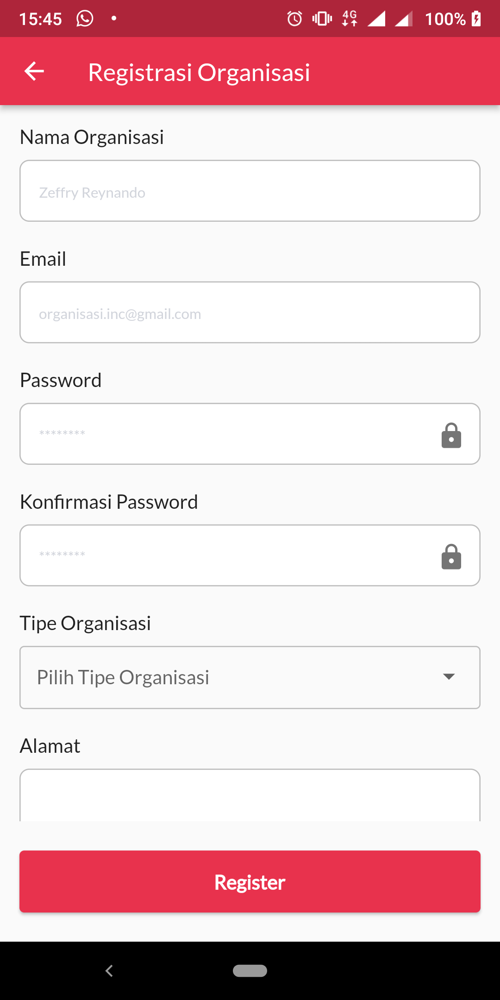
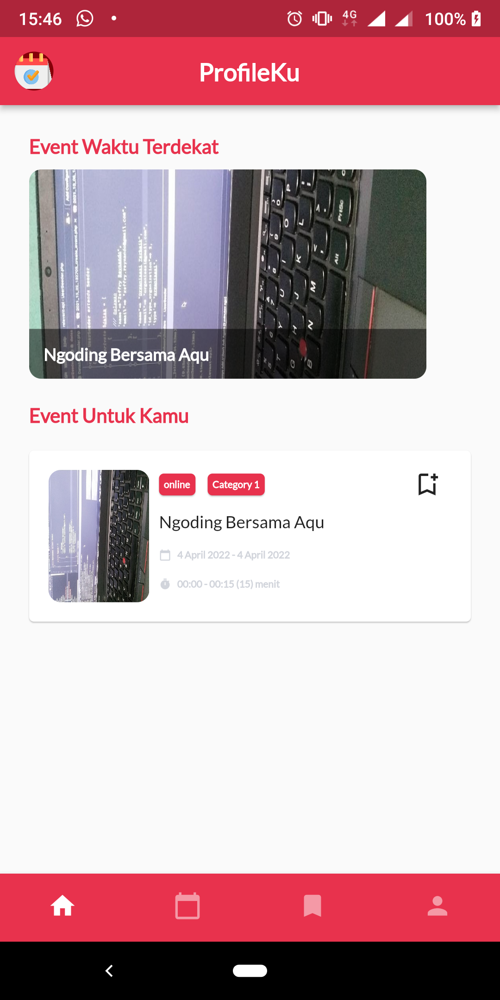
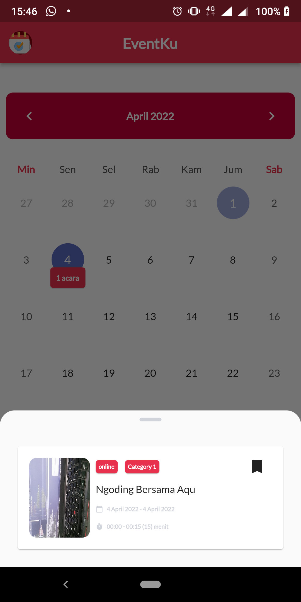
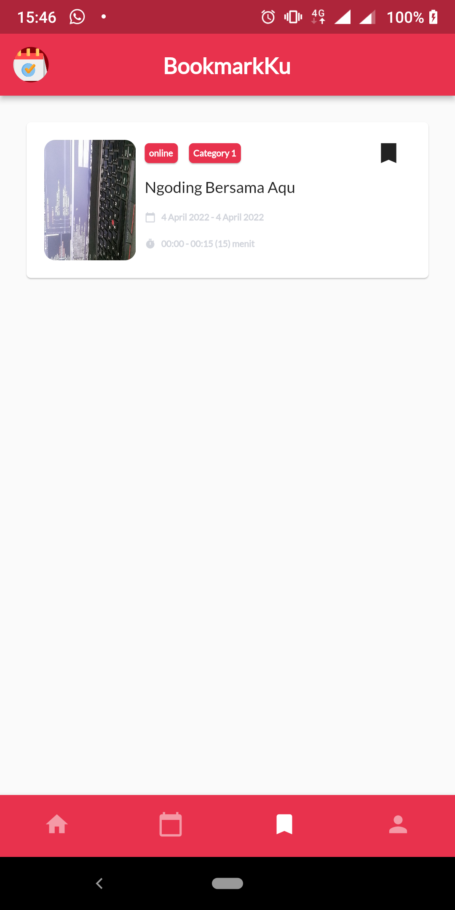
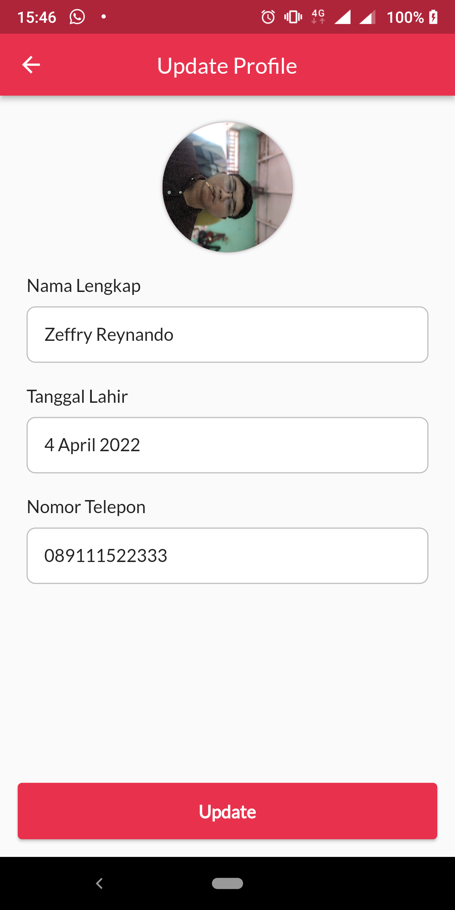
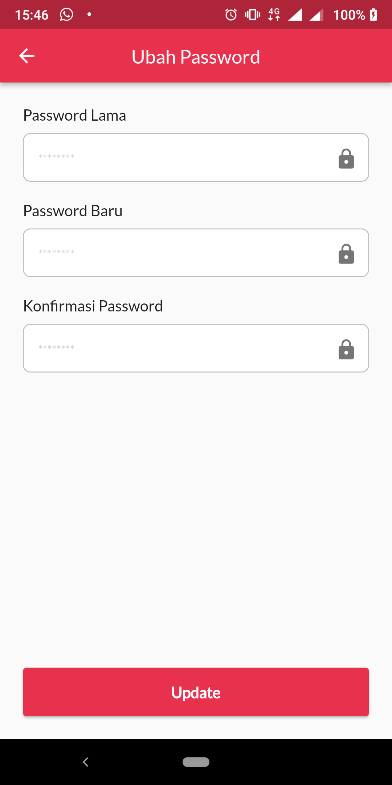
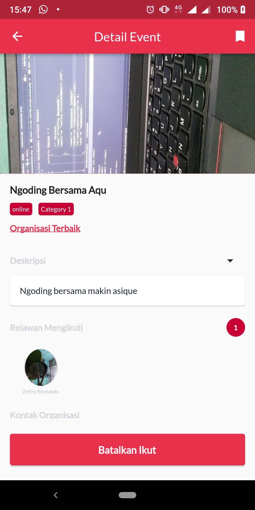

[](https://github.com/zgramming?tab=followers)


<p align="center">
  
</p>

# Relevant

Relawan Event Application consume REST API Relevant-API using Flutter. This project 5th Final Project Teknologi Web Service.

## Usage


Before usage this application, you must ensure several configurations, including:

1. you have to make sure you have configured REST API first. You can follow <a target="_blank" href="https://github.com/zgramming/Relevant-API">this</a> for get the API.
2. In `src/utils/constant.dart`, make sure you pointing to your host 
```
const baseUrl = kDebugMode ? 'http://192.168.42.216:8000' : 'http://192.168.42.216:8000';
```

## Feature

- [x] Login as Relawan / Organisasi
- [x] Register as Relawan / Organisasi
- [x] Nearest time event
- [x] EFY (Event For You)
- [x] Bookmark Event
- [x] My Event (Show your joined event as Calendar)
- [x] Update Profile
- [x] Update Password
- [x] Detail Event
- [x] Join or Cancel event
 
## Preview Application


<table>
  <tr>
    <td></td>
    <td></td>
    <td></td>
  </tr>
   <tr align="center">
    <!-- <td>List of musics</td>
    <td>Detail Music</td>
    <td>Share to Instagram</td> -->
  </tr>
  <tr>
    <td></td>
    <td></td>
    <td></td>
  </tr>
  <tr align="center">
    <!-- <td>Info Application</td>
    <td>Sort By Feature</td> -->
  </tr>
  <tr>
    <td></td>
    <td></td>
    <td></td>
  </tr>
 </table>


## Issues

Please file any issues, bugs or feature request as an issue on <a href="https://github.com/zgramming/Relevant/issues"><b> Github </b></a>

## Contributing

Pull requests are welcome. For major changes, please open an issue first to discuss what you would like to change.

<br>


<table border="0" cellspacing="0" cellpadding="0">
    <thead>
        <tr>
            <th>Github</th>
            <th>LinkedIn</th>
            <th>Facebook</th>
            <th>Instagram</th>
            <th>Website</th>
        </tr>
    </thead>
    <tbody>
        <tr>
            <td>
            <a href="https://github.com/zgramming/" target="_blank"></a>
            </td>
            <td><a href="https://www.linkedin.com/in/zeffry-reynando" target="_blank"></a></td>
            <td><a href="https://www.facebook.com/zeffry.reynando" target="_blank"></a></td>
            <td><a href="https://www.instagram.com/zeffry_reynando" target="_blank"></a></td>
            <td><a href="https://zeffry.dev/" target="_blank"></a></td>
        </tr>
    </tbody>

</table>